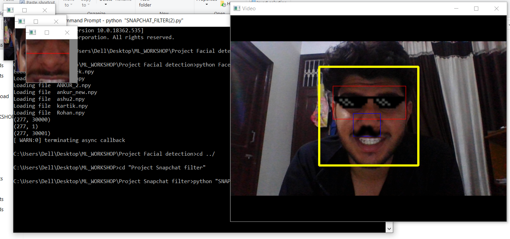
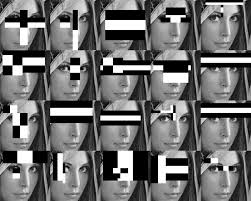
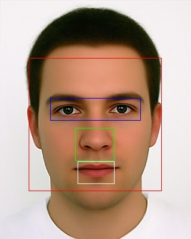
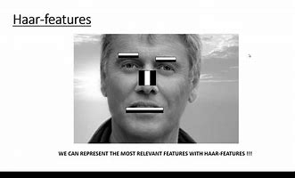
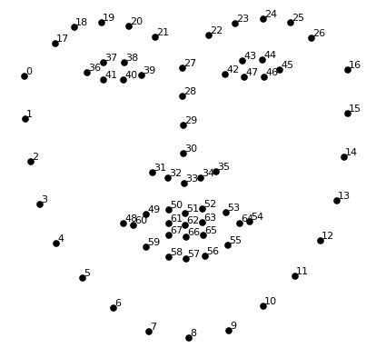
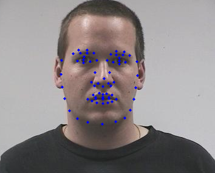

# Snapchat_like_filter_generation
Haar like feature are extracted using Haarcascade open cv in order to detect Mouth, Nose, Ear, Eyes and face. Filters can be resized and put accordingly

### SCREENSHOT

### Haar-Like Features

### Detection

Dlib HOG can also be used to extract upto 128 facial landmarks

### HOG Facial landmarks

#### Application Virtual trial room:- https://github.com/Ankuraxz/Syzzo-live-makeup

